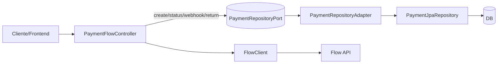
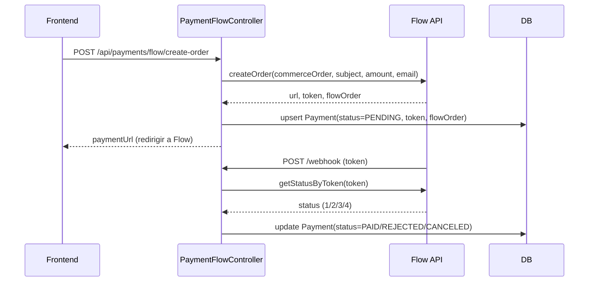

# Payment Core — README

> Cobros con Flow (CL) usando Spring Boot + Clean Architecture.  
> **Resumen en simple:** la app es una tiendita. El **Controller** es la puerta, **Flow** es la caja registradora externa, el **FlowClient** es el teléfono para hablar con Flow, y el **RepositoryAdapter** es quien anota todo en el cuaderno (BD).

---

## 🚀 Quick start

### Requisitos
- Java 17+
- Maven 3.9+
- (Opcional) MySQL / H2

### Configuración
En `src/main/resources/application.properties` (ya incluido):

```properties
flow.base-url=${FLOW_BASE_URL:https://sandbox.flow.cl/api}
flow.api-key=${FLOW_API_KEY:changeme}
flow.secret-key=${FLOW_SECRET_KEY:changeme}
flow.return-url=${FLOW_RETURN_URL:http://localhost:5007/api/payments/flow/return}
flow.confirmation-url=${FLOW_CONFIRMATION_URL:http://localhost:5007/api/payments/flow/webhook}
```

> Para probar desde tu PC, usa un túnel (ngrok, localtunnel) y apunta `flow.return-url` y `flow.confirmation-url` a URLs públicas HTTPS.

### Ejecutar
```bash
mvn clean spring-boot:run
# o
mvn -DskipTests package
java -jar target/payment-core-*.jar
```

---

## 🧩 Arquitectura (resumen)

- **Domain**
  - `Payment` + `PaymentStatus`
- **Ports**
  - `PaymentRepositoryPort`: contrato de persistencia
- **Adapter Out (DB)**
  - `PaymentEntity` (JPA)
  - `PaymentJpaRepository` (Spring Data)
  - `PaymentRepositoryAdapter` (Entity↔Domain + consultas)
- **Services / Flow**
  - `FlowClient` (HTTP a Flow)
  - `FlowProps` (propiedades)
  - `FlowSigner` (HMAC-SHA256)
- **Adapter In (Web)**
  - `PaymentFlowController` (REST)

### Diagrama de componentes (Mermaid)


### Flujo de pago (Mermaid)


---

## 🛠 Endpoints

Base: `/api/payments/flow`

### 1) Crear orden
`POST /create-order` `application/json`

**Request**
```json
{
  "subject": "Orden de prueba",
  "amount": 12500,
  "email": "buyer@example.com",
  "commerceOrder": "ORD-123",
  "paymentMethod": 9
}
```

**Response**
```json
{
  "paymentUrl": "https://.../payment/create?token=XYZ",
  "token": "XYZ",
  "flowOrder": 1234567,
  "commerceOrder": "ORD-123"
}
```

**cURL**
```bash
curl -X POST http://localhost:5007/api/payments/flow/create-order   -H "Content-Type: application/json"   -d '{"subject":"Orden de prueba","amount":12500,"email":"buyer@example.com"}'
```

### 2) Webhook (Flow → Tu API)
`POST /webhook` `application/x-www-form-urlencoded`

**Request**
```
token=XYZ
```

**Response**
```
OK
```

> Flow llamará esta URL para confirmar el estado.

### 3) Return (Flow → Tu API)
`POST /return` `application/x-www-form-urlencoded`

**Request**
```
token=XYZ
```

**Response (texto simple)**
```
Pago PAID | Orden: ORD-123 | FlowOrder: 1234567
```

### 4) Consultar estado local
`GET /status/{commerceOrder}`

**Response**
```json
{
  "commerceOrder": "ORD-123",
  "status": "PAID",
  "flowOrder": 1234567
}
```

**cURL**
```bash
curl http://localhost:5007/api/payments/flow/status/ORD-123
```

---

## 📦 Modelo y persistencia

### Dominio: `Payment`
Campos principales:
- `id`, `commerceOrder` (único), `token` (único), `flowOrder`
- `subject`, `currency` (`CLP` por defecto), `amount`, `email`
- `status` (`PENDING`, `PAID`, `REJECTED`, `CANCELED`, `UNKNOWN`)
- `rawProviderStatus`, `requestDate`
- `createdAt`, `updatedAt`

### Entidad JPA: `PaymentEntity`
- Tabla: `payments`
- **Unique**: `commerceOrder`, `token`
- Índices: `status`, `createdAt`
- Timestamps: `@CreationTimestamp`, `@UpdateTimestamp`

---

## 🔐 Firma y propiedades

- `FlowSigner` genera `s = HMAC_SHA256(join(sortedKeys(key+value)))`
- `FlowClient` envía `apiKey`, parámetros y `s` en cada request.

**Variables importantes**
- `FLOW_BASE_URL` (sandbox/prod)
- `FLOW_API_KEY` / `FLOW_SECRET_KEY`
- `FLOW_RETURN_URL` / `FLOW_CONFIRMATION_URL` (públicas y HTTPS en prod)

---

## 🔎 Mapeo de estados

| Flow `status` | Dominio `PaymentStatus` |
|---|---|
| 1 | `PENDING`  |
| 2 | `PAID`     |
| 3 | `REJECTED` |
| 4 | `CANCELED` |
| otro | `UNKNOWN` |

---

## 🧪 Tips de pruebas

- Usa **sandbox** de Flow.
- Levanta un túnel (ngrok) para `return` y `webhook`:
  - `https://<tu-ngrok>/api/payments/flow/return`
  - `https://<tu-ngrok>/api/payments/flow/webhook`
- Verifica que la BD tenga el `Payment` en `PENDING` después de crear la orden y que cambie a `PAID/REJECTED/CANCELED` tras el webhook.

---

## 📁 Estructura relevante

```
src/main/java/cl/codeox/payment/payment_core
├─ adapter
│  ├─ in/web/payment/PaymentFlowController.java
│  └─ out/persistence/...
│     ├─ entity/payment/PaymentEntity.java
│     ├─ jpa/payment/PaymentJpaRepository.java
│     └─ repository/PaymentRepositoryAdapter.java
├─ application
│  ├─ config/PaymentFlowConfig.java
│  └─ services/payment/flow/{FlowClient,FlowProps,FlowSigner}.java
├─ domain/payment/{Payment,PaymentStatus}.java
└─ port
   └─ out/payment/{PaymentRepositoryPort,PaymentSearchCriteria}.java
```

---

## 📜 Licencia
MIT (o la que definas para el repo).


/**
vale, imagina que tu app es una tiendita y todo lo demás son personitas ayudantes. 🛒

¿Quién es quién?

Controller (PaymentFlowController) = la puerta de la tienda. Aquí llegan y salen los mensajes.

Flow = una caja registradora gigante en otro edificio. Cobra por ti.

FlowClient = el teléfono con el que llamas a esa caja registradora para decir “oye, quiero cobrar”.

FlowSigner = el apretón de manos secreto para que Flow sepa que eres tú.

FlowProps = un papelito con la dirección de Flow y tus llaves (apiKey, secret, URLs).

Payment (dominio) = la tarjeta donde apuntas el cobro (monto, estado, etc.).

PaymentEntity (entidad JPA) = cómo esa tarjeta se guarda en el cuaderno (la base de datos).

PaymentRepositoryPort = las reglas del juego para guardar y leer tarjetas (contrato).

PaymentRepositoryAdapter = el traductor que sabe jugar según esas reglas y hablar con el cuaderno real.

PaymentJpaRepository = el bibliotecario que escribe y lee del cuaderno.

¿Qué pasa cuando alguien paga?

Crear orden (POST /api/payments/flow/create-order)

La puerta (Controller) recibe “quiero pagar…”.

Llama por teléfono (FlowClient) a la caja registradora (Flow) y le pide una orden de pago.

Flow devuelve una dirección web y un token (como un tiquetito).

La tienda anota/actualiza una tarjeta Payment en el cuaderno (BD) con estado PENDING usando el traductor (Adapter/RepositoryPort).

La puerta le da al cliente la URL para ir a pagar.

El cliente paga en Flow

El cliente va a la URL de Flow y paga allí.

Flow avisa el resultado (webhook: POST /webhook)

Llega el cartero (webhook) con un token.

La puerta toma ese token, llama por teléfono a Flow para preguntar “¿cómo salió?”.

Con la respuesta de Flow, la tienda actualiza la tarjeta:

1 → PENDING

2 → PAID ✅

3 → REJECTED ❌

4 → CANCELED 🚫

Se guarda otra vez en el cuaderno.

Página de vuelta (POST /return)

Es parecido al webhook: con el token, pregunta a Flow y actualiza el estado en el cuaderno.

Muestra un mensajito: “Pago PAID | Orden: …”.

Consultar estado (GET /status/{commerceOrder})

La puerta busca en el cuaderno la tarjeta por commerceOrder y te dice en qué estado está.

¿Cómo se guardan las cosas?

La tarjeta bonita (Payment) se convierte a formato cuaderno (PaymentEntity) con el traductor (Adapter).

El bibliotecario (PaymentJpaRepository) escribe/lee del cuaderno.

El contrato (PaymentRepositoryPort) asegura que la puerta y el traductor siempre sepan cómo pedir y guardar cosas, sin importar el cuaderno.

Ideas clave (versión súper simple)

Llamas a Flow (teléfono) → Flow te da un token y una URL → apuntas “PENDING” en tu cuaderno.

Flow te avisa (cartero) o tú preguntas (teléfono) → actualizas la tarjeta a PAID/REJECTED/CANCELED.

Siempre que quieras saber, lees la tarjeta del cuaderno.

y listo: tu tiendita cobra segura, ordenada y sin enredos 🤝✨
**/


